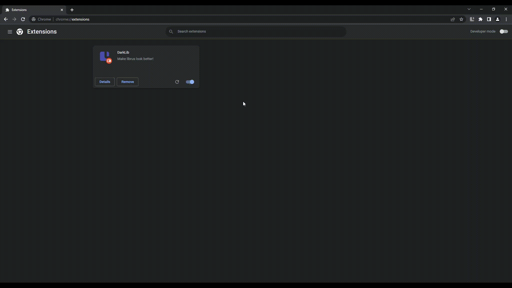

# Custom Command documentation folders
A simple extension allowing you to fold sections in CC docs

## Features

- Sections of [CC docs](https://doc.ccommandbot.com/) become foldable
> 
> [Watch as a video](guide/preview.mp4)

- Gives you control over the favicon
  

## Supported platforms
There are currently two builds available:
- **Chromium** - will work on Chrome and other Chromium-based browsers
> [Chromium installation guide](guide/chromium.md)
- **Firefox** - A special build for firefox signed by Mozilla
> [Firefox installation guide](guide/firefox.md)

## Installation
1. Download the [extension.zip](/builds/chromium/extension.zip?raw=true) file
2. Open extensions tab in your browser
3. Turn on the developer mode
4. Drag in the file
> 
> [Watch as a video](guide/installation.mp4)

## Custom Command
This extension adds more functionality to the documentation of [Custom Command bot](https://ccommandbot.com).
This is not an official extension, and neither am I the owner of the documentation, nor the Custom Command bot.

## Support
Found a bug? Wanna suggest a feature? 
Feel free to reach me out (`fajfaj#6941`) in the [Custom Command support server](https://ccommandbot.com/join)
