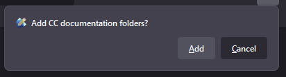
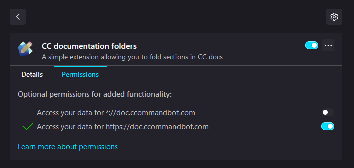

# Installation
1. Download the [extension.xpi](/builds/firefox/download/extension.xpi?raw=true) file
2. Open extensions tab in firefox
3. Drag in the file
4. Confirm installation
> 
1. Allow the extension to access `https://doc.ccommandbot.com/`
> 